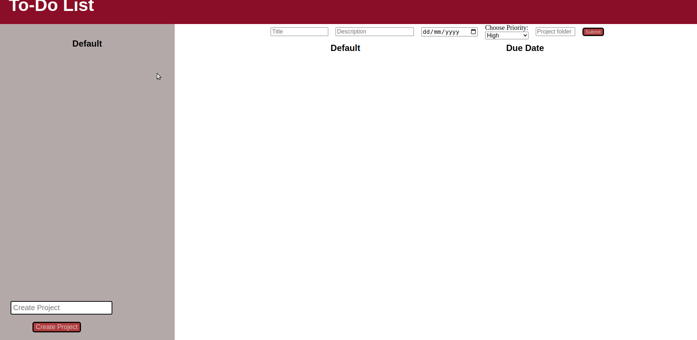

<h1> To-Do List </h1>

<h2>Brief Introduction </h2>

A To-Do app that allows you to create project files, add your todos into any project files you choose, edit the todos and toggle them when they're completed.  Each todo can be set a priority where the user can visually see tasks that are high priority, medium priority, or low priority.  Further, each todo can be given a due date so that users can organize their everyday tasks, and remove any task they wish whenever they desire it.  Each project can be toggled through so that the todos in each project list can be viewed on the webpage.  The app also supports localStorage so that users can save their todos on their computers when they refresh or close the browser.

<h2>Skills Demonstrated</h2>

The completion of this project has grown my skills in DOM manipulation and usage of Factories as well as the Module pattern.  Furthermore, it allowed me to get my feet deeper into webpack and hone my knowledge on OOP principles.  By applying the SOLID principles, mainly the Single Responsibility in my code logic I've been able to experience more what Software Engineering can be like.

<h2>Challenges I Faced</h2>

A challenge I faced from tackling this project was picturing how I would split up all the different functions while maintaining SOLID principles.  I solved this problem by taking some time to write down my thoughts on how I wanted to set up the functions.  After spending some time writing code down and figuring out the structure of my application, I applied the written code to the program and I was able to complete my work much easier.

## Available Scripts

In the project directory, you can run:

### `npm start`

Runs the app in the development mode.\
Open [http://localhost:3000](http://localhost:3000) to view it in the browser.

The page will reload if you make edits.\
You will also see any lint errors in the console.

### `npm test`

Launches the test runner in the interactive watch mode.\
See the section about [running tests](https://facebook.github.io/create-react-app/docs/running-tests) for more information.

### `npm run build`

Builds the app for production to the `build` folder.\
It correctly bundles React in production mode and optimizes the build for the best performance.

The build is minified and the filenames include the hashes.\
Your app is ready to be deployed!

See the section about [deployment](https://facebook.github.io/create-react-app/docs/deployment) for more information.

### `npm run eject`

**Note: this is a one-way operation. Once you `eject`, you can’t go back!**

If you aren’t satisfied with the build tool and configuration choices, you can `eject` at any time. This command will remove the single build dependency from your project.

Instead, it will copy all the configuration files and the transitive dependencies (webpack, Babel, ESLint, etc) right into your project so you have full control over them. All of the commands except `eject` will still work, but they will point to the copied scripts so you can tweak them. At this point you’re on your own.

You don’t have to ever use `eject`. The curated feature set is suitable for small and middle deployments, and you shouldn’t feel obligated to use this feature. However we understand that this tool wouldn’t be useful if you couldn’t customize it when you are ready for it.

## Learn More

You can learn more in the [Create React App documentation](https://facebook.github.io/create-react-app/docs/getting-started).

To learn React, check out the [React documentation](https://reactjs.org/).

### Code Splitting

This section has moved here: [https://facebook.github.io/create-react-app/docs/code-splitting](https://facebook.github.io/create-react-app/docs/code-splitting)

### Analyzing the Bundle Size

This section has moved here: [https://facebook.github.io/create-react-app/docs/analyzing-the-bundle-size](https://facebook.github.io/create-react-app/docs/analyzing-the-bundle-size)

### Advanced Configuration

This section has moved here: [https://facebook.github.io/create-react-app/docs/advanced-configuration](https://facebook.github.io/create-react-app/docs/advanced-configuration)

### Deployment

This section has moved here: [https://facebook.github.io/create-react-app/docs/deployment](https://facebook.github.io/create-react-app/docs/deployment)

### `npm run build` fails to minify

This section has moved here: [https://facebook.github.io/create-react-app/docs/troubleshooting#npm-run-build-fails-to-minify](https://facebook.github.io/create-react-app/docs/troubleshooting#npm-run-build-fails-to-minify)

<h2>Live Demo</h2>

To use the app, if you wish to create todos in the default folder, simply click on the 'Create ToDo' button on the bottom of the page.  You can create new project folders by clicking on the 'Create Projects' button on the bottom-left side of the page.  Window prompts will ask you to enter information such as the title, description, due date, and priority of the task, all of which must be entered.  The date must be entered in 'mm/dd/YYYY' format as well.  

To access the app, click on the following link:

https://ramankala.github.io/todo-list/

